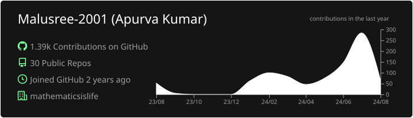
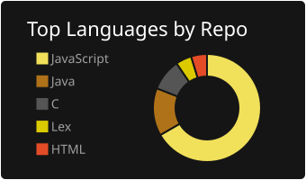
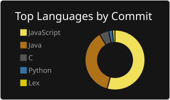
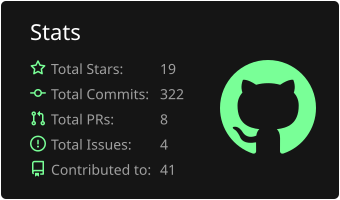
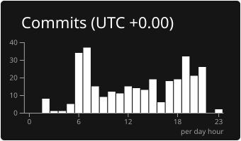

## dark

[](https://github.com/Malusree-2001/Malusree-2001)
[](https://github.com/Malusree-2001/Malusree-2001) [](https://github.com/Malusree-2001/Malusree-2001)
[](https://github.com/Malusree-2001/Malusree-2001) [](https://github.com/Malusree-2001/Malusree-2001)
### Now you can add this to your markdown
```

[](https://github.com/Malusree-2001/Malusree-2001)
[](https://github.com/Malusree-2001/Malusree-2001) [](https://github.com/Malusree-2001/Malusree-2001)
[](https://github.com/Malusree-2001/Malusree-2001) [](https://github.com/Malusree-2001/Malusree-2001)

```

### Each card usage
---


```

```

    

---


```

```

    

---


```

```

    

---


```

```

    

---


```

```

    
